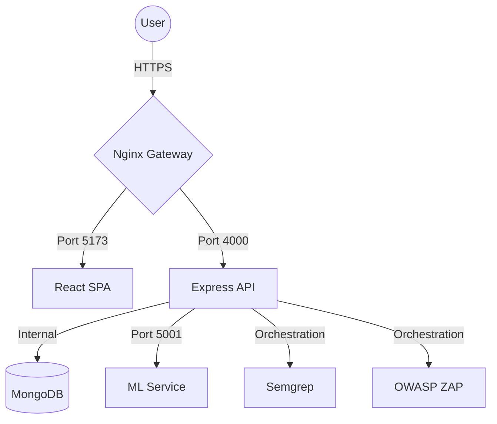

# 🛡️ SecOps Platform

[](https://opensource.org/licenses/MIT)
[](https://nodejs.org/)
[](https://reactjs.org/)
[](https://tailwindcss.com/)
[](https://www.docker.com/)

An enterprise-grade **DevSecOps Orchestration Platform** designed to unify security testing, machine learning insights, and automated delivery pipelines. 

🌐 **Live Demo:** [os-secops.software](https://os-secops.software)

> **Bridging the gap between Development, Security, and Operations.**

---

## ✨ Key Features

- **🚀 Automated Security Pipelines:** Orchestrate SAST (Semgrep) and DAST (OWASP ZAP) scans automatically on every push.
- **🤖 AI-Powered Threat Detection:** Integrated Python ML Service for predicting vulnerability impact and anomaly detection.
- **📊 Unified Security Dashboard:** Real-time visualization of security posture, pipeline health, and compliance metrics.
- **🔐 Secure Authentication:** Robust JWT-based auth system with HTTP-only refresh tokens and role-based access control (RBAC).
- **🔔 Intelligent Alerting:** Multi-channel notifications via Slack and Email for critical security findings.
- **📜 Immutable Audit Logs:** Compliance-ready tracking of every action taken within the platform.
- **⚓ GitHub Integration:** Webhook support for seamless synchronization with your source control.

---

## 🛠️ Tech Stack

### Frontend
- **Framework:** React 18 (Vite)
- **Styling:** Tailwind CSS + Vanilla CSS (Glassmorphism UI)
- **State/Hooks:** Custom Context API + Hooks
- **Icons:** Lucide-React
- **Charts:** Recharts

### Backend
- **Runtime:** Node.js (Express)
- **Database:** MongoDB (Mongoose)
- **Security:** Helmet, Rate-limiting, CORS, JWT
- **Orchestration:** Child Process management for security tool CLI interaction

### ML Service
- **Language:** Python 3.10
- **Framework:** Flask
- **Intelligence:** Scikit-Learn for vulnerability classification

### Infrastructure
- **Proxy:** Nginx (Reverse proxy & Static serving)
- **Containerization:** Docker & Docker Compose
- **Tools:** Semgrep, OWASP ZAP

---

## 📐 Architecture

The platform follows a microservices architecture coordinated via a centralized Nginx Gateway.



---

## 🚀 Quick Start

### Prerequisites
- Docker & Docker Compose
- A MongoDB Atlas URI (or local MongoDB)

### 1. Clone & Environment
```bash
git clone https://github.com/your-repo/devsecops-platform.git
cd devsecops-platform
```

Copy the `.env.example` to `.env` in the `backend/` folder and fill in your credentials.

### 2. Run with Docker (Recommended)
Launch the entire ecosystem with one command:
```bash
docker-compose up -d
```
The platform will be available at **`http://localhost`**.

### 3. Manual Development Setup
If you prefer running services individually:

| Service | Commands |
| :--- | :--- |
| **Backend** | `cd backend && npm install && npm run dev` |
| **Frontend** | `cd frontend && npm install && npm run dev` |
| **ML Service** | `cd ml-service && pip install -r requirements.txt && python app.py` |

---

## 🛡️ Security Roadmap

- [ ] **Phase 1:** SAST/DAST Integration (Completed)
- [ ] **Phase 2:** ML Vulnerability Prediction (Current)
- [ ] **Phase 3:** Kubernetes Operator for Dynamic Scans (Planned)
- [ ] **Phase 4:** Automatic Patch Generation using LLMs (Future)

---

## 🤝 Contributing

Contributions are what make the open-source community such an amazing place to learn, inspire, and create. Any contributions you make are **greatly appreciated**.

1. Fork the Project
2. Create your Feature Branch (`git checkout -b feature/AmazingFeature`)
3. Commit your Changes (`git commit -m 'Add some AmazingFeature'`)
4. Push to the Branch (`git push origin feature/AmazingFeature`)
5. Open a Pull Request

---

## 📄 License

Distributed under the MIT License. See `LICENSE` for more information.

---

<p align="center">
  Built with ❤️ by Oussama SAIDI
</p>
